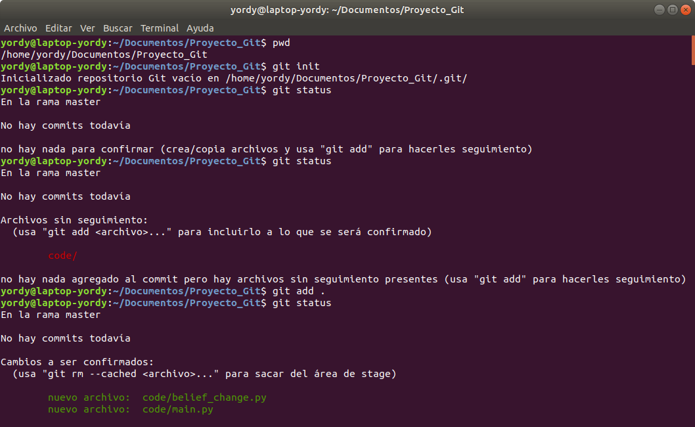
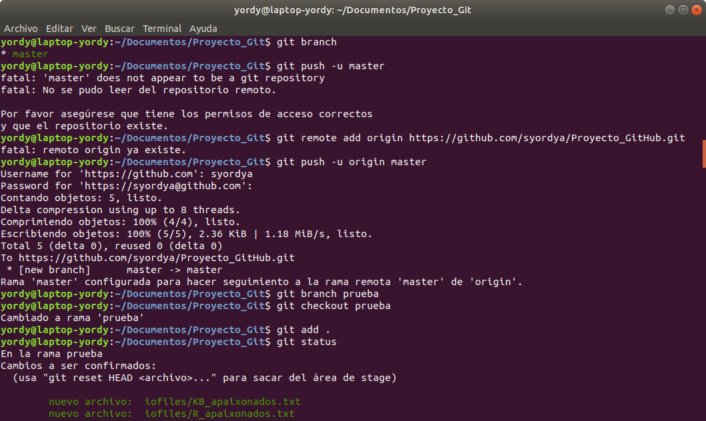
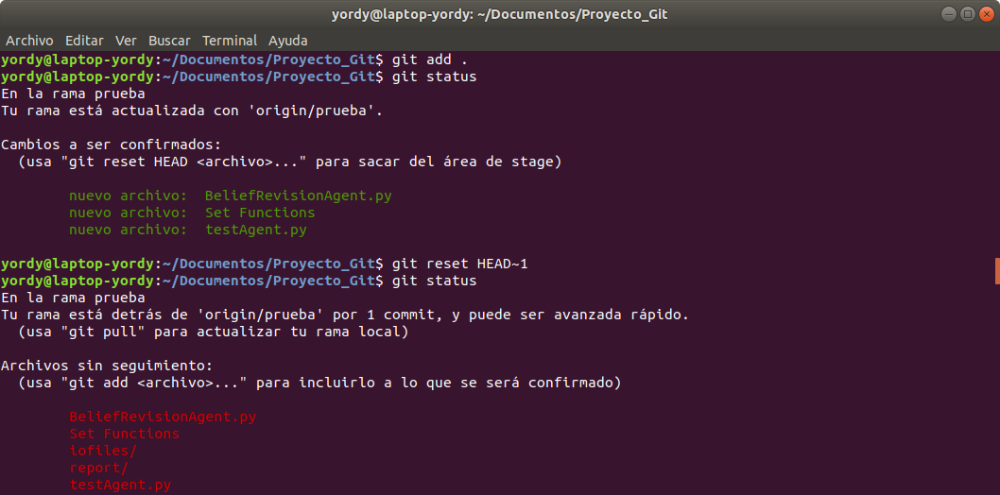

# Tutorial de Git y Github
Guia de comandos de Git y GitHub

# Git local

mkdir.. : Crear la carpeta de nuestro proyecto Git

pwd : Localizar el proyecto

cd.. : Ubicar el proyecto en el terminal

git init : Inicializa el repositorio Git

git status : Consulta lo que ha cambiado

git add . : Agrega todos los archivos al repositorio

git commit -m "Commit" : Guarda todos tus cambios con un comentario

git branch : Ver todas las ramas

git branch 'Branch' : Crear rama

git checkout 'Branch' : Entrar a la rama

git pull : Mezcla los cambios de repositorio

# GitHub

git config --global user.email "syordya@gmail.com"

git config --global user.name "Yordy Santos"

git remote add origin https://github.com/syordya/Proyecto_GitHub.git

git push -u origin 'Branch' : Subir los cambios a GitHub
