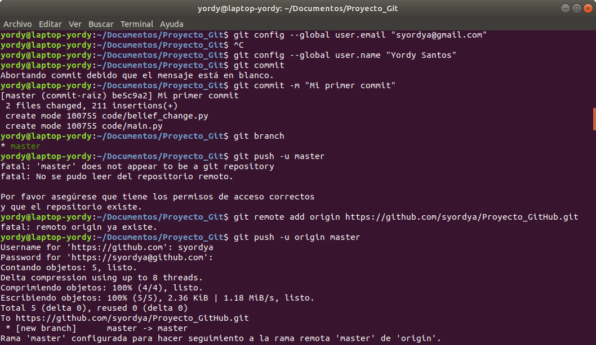

# Tutorial de Git y Github
Git es un software de código abierto desarrollado por Linux, tambien se puede usar en Windows y Mac, en este tutorial aprenderemos los comandos básicos de Git y GitHub.

### Autor
[Yordy W. Santos Apaza](https://github.com/syordya)

### Definiciones
* Commit: identifica los cambios hechos.
* Branch: se pueden pensar como una línea de tiempo a partir de los commit. Hay siempre como mínimo una rama principal o predefinida llamada master.
* Merge: fusionar la rama en la que se esta trabajando con la original.
* Push: sube los cambios hechos a una rama de trabajo tuya y/o de tu equipo remota.
* Pull: actualizar su rama HEAD actual con los últimos cambios desde el servidor remoto.

## Git (local)

mkdir.. : Crear la carpeta de nuestro proyecto Git

pwd : Localizar el proyecto

cd.. : Ubicar el proyecto en el terminal

git init : Inicializa el repositorio Git

git status : Consulta lo que ha cambiado

git add . : Agrega todos los archivos al repositorio

git branch : Ver todas las ramas

git branch 'Branch' : Crear rama

git checkout 'Branch' : Entrar a la rama

git reset HEAD~1 : Mezcla los cambios de repositorio y lo actualiza localmente

git pull : Mezcla los cambios de repositorio y lo actualiza localmente

git commit -m "Commit" : Guarda todos tus cambios con un comentario

## GitHub (remote)

git config --global user.email "syordya@gmail.com"

git config --global user.name "Yordy Santos"

git remote add origin https://github.com/syordya/Proyecto_GitHub.git

git push -u origin 'Branch' : Subir los cambios a GitHub

